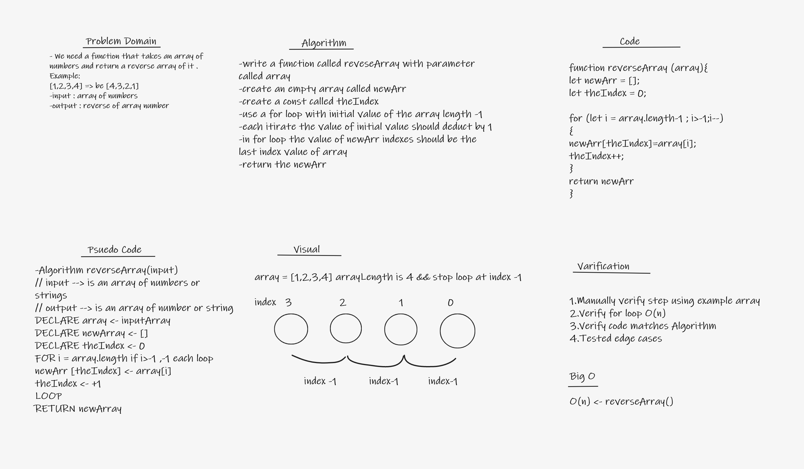

 # Code Challenge: Class 01
 
 

 ## Code 

 'use strict';

 function reverseArray (array){

     let newArr = [];

     let theIndex = 0;

     for (let i =array.length-1 ; i>-1;i--){

         newArr[theIndex] = array[i]

         theIndex ++ ;

     }

     return newArr
     
 }

