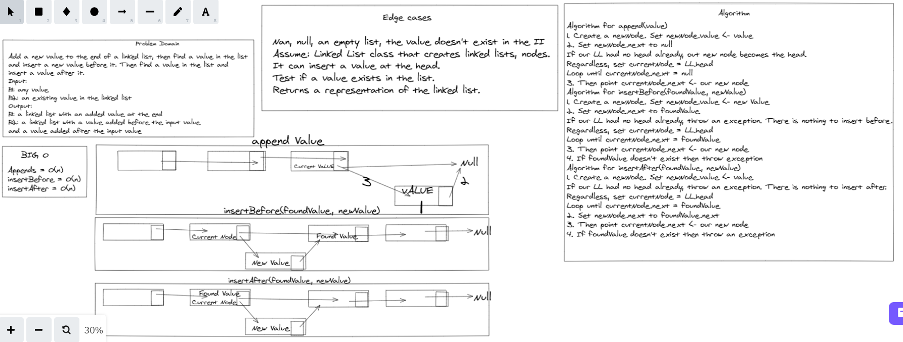

# Linked List Insertions 

## Approach & Efficiency 

**Big O Notation**

* LinkedList.append() - O(n)
* LinkedList.insertBefore() - O(1) (plus time to search for value)
* LinkedList.insertAfter() - O(1) (plus time to search for value)

## Whiteboard Solution

