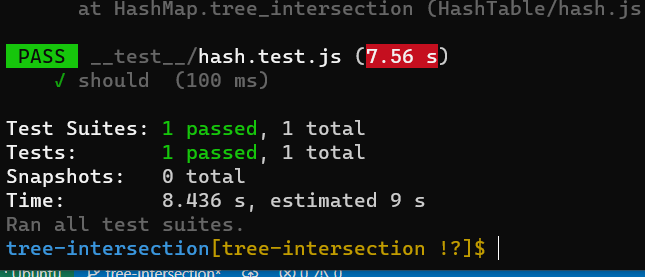

# Tree intersection

## Challenge Description

1. Write a function called tree_intersection that takes two binary tree parameters.

2. Without utilizing any of the built-in library methods available to your language, return a set of values found in both trees.

## Approach & Efficiency
* Space: O(n)

* Time: O(n)

## Test 

