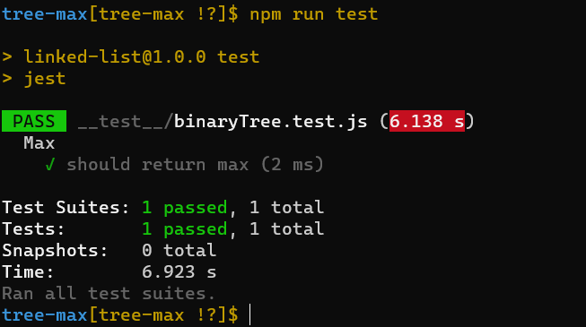
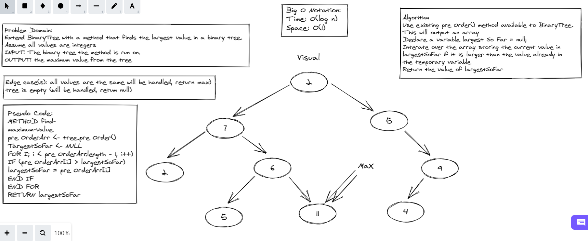

# Tree Max 

Create a Node class

* Create a Node class that has properties for the value stored in the node, the left child node, and the right child node.

Create a BinaryTree class

* Define a method for each of the depth first traversals called preOrder, inOrder, and postOrder which returns an array of the values, ordered appropriately. Also add findMaximumValue(arr) which find the maximum value in an array returned by the previous methods. Add a breadthFirst method which should return an array representing a level order traversal.

## Challenge
BinaryTree should have these four different methods:

.preOrder() ()

Input: the binary tree the method is called on
Output: array of values using preOrder sort

.inOrder() ()

Input: the binary tree the method is called on
Output: array of values using preOrder sort

.postOrder() ()

Input: the binary tree the method is called on
Output: array of values using inOrder sort

.Max(arr) 

(takes in an array returned by one of the methods above)
Input: an array returned by preOrder(), inOrder() or postOrder()
Output: an integer with the maximum value found in the tree

## Approach & Efficiency

**Big O Notation**

* Binary search tree insertion and search is a worst case of O(log n) on a balanced tree, or on an unbalanced tree it is O(height). Space should be Big O(1) for search. For methods that show a representation of the tree the Big O time varies from O(1) to O(height^2).

## Testing

## WhiteBoard 

